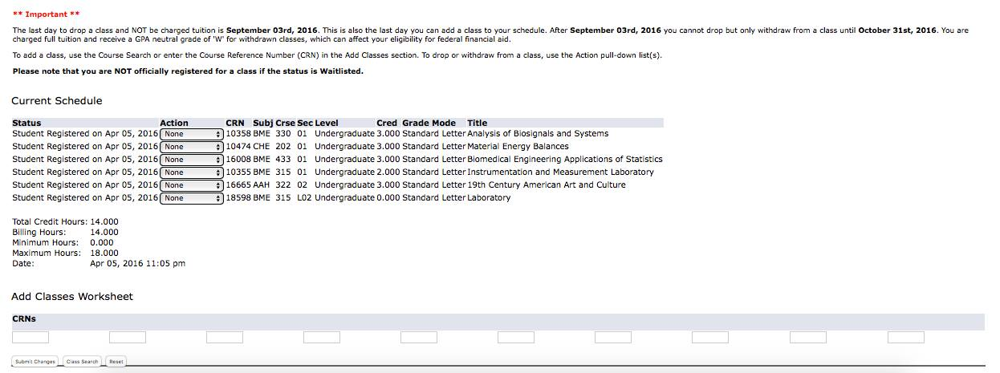

# **Step One**
The user enters in [the url] (http://my.iit.edu/cp/home/check/post?js=true&java=false).
This sends users to an annoying page that checks to see if they have Java support.
One problem with this page is that the [clicking here] (http://my.iit.edu/jsp/misc/java_cook.jsp) 
link will not give you an updated way to turn on JavaScript if it is actually turned off. 
We will not have this page in our final design.

# **Step Two**
The [Login Page] (https://my.iit.edu/cp/home/displaylogin) is the page you are usually looking for when going to MyIIT portal.
The main problem with this page is that the login box is not the focus of this page. This page isn't updated often,
and shows its age after exploring. Another problem is that you have to scroll to get to the full value of the page.
With a page like this it is very rare that a user will choose to go all the way to the bottom.

This is our current design fix:

# **Step Three**
Below is our Welcome Page. This and all pages after are inaccessible if you are not an IIT student or IIT faculty. 
The MyIIT portal will never win style awards. More importantly, it is hard to find **anything** quickly or without a lot of clicking.

# **Step Four**
This is the Academics Tab. This page isn't much different from the Welcome Page, ugly and messy.
It's also hard to tell what tab you are in and it can take a second to load after you click.
the link to the next step is the Add or Drop Class link.

# **Step Five**
The Add/Drop Page is one of the few pages that is "mobile friendly" (notice quotations). 
This will not be in our final project we believe you should choose the term in the previous step.

# **Step Six**
Another "Mobile Friendly" page. It would be fine if you only saw this page once a semester,
However, you have to enter in your pin every time you want to add or drop classes. 
Also, notice that the pin is found all the way on the Welcome Page. The Welcome Page was Step Number Three.

# **Step Seven**
The final step of registration. To directly add classes the user would have to use the CRN code of the class and 
enter it into the Add Classes Worksheet. This is the only way the student can directly register for classes without
searching classes. Which by the way send the user to many more screens.

